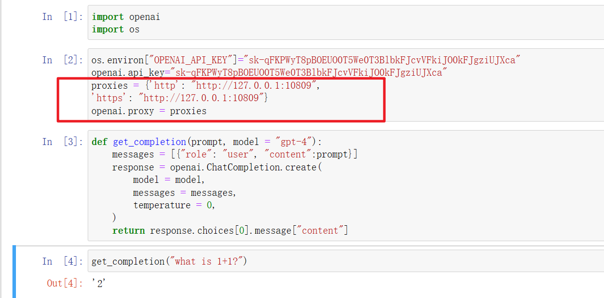

基本思路是，用爬虫获取威科搜索结果然后将前三个返回，使用chatgpt接口结构化输出嘛

 

 

## 第一个问题---搜索形式

就是：你直接输入的问句大概率是搜不到相应的内容的。


 


 

简化搜索不好使


 

关键词+布尔运算，效果很好（主要参考一些图书馆的搜索方式）


 


## 第二个问题---request

使用爬虫一开始尝试了，主要是采用了request

```
https://www.wkinfo.com.cn/login/index

https://law.wkinfo.com.cn/legislation/list
```


 soup如下

```html
<!DOCTYPE html>

<html lang="zh">
<head>
<meta charset="utf-8"/>
<title>威科先行•法律信息库|专业的中英双语法律信息库</title>
<base href="/"/>
<meta content="IE=edge,chrome=1" http-equiv="X-UA-Compatible"/>
<meta content="text/html;charset=utf-8" http-equiv="Content-Type"/>
<meta content="no-cache" http-equiv="Cache-Control"/>
<meta content="no-cache" http-equiv="Pragma"/>
<meta content="0" http-equiv="Expires"/>
<meta content="webkit" name="renderer"/>
<meta content="由威科集团专为中国市场打造的一款专业的法律信息查询工具，集法律法规、法律专递、裁判文书（案例）、常用法律文书模板、实务指南、法律英文翻译等各类法律信息于一体。内容权威，更新及时，智能搜索，专业的分类导航，是国内诸多专业法律人士日常工作的必备工具。" name="description"/>
<meta content="法律法规，法律英文翻译、裁判文书，裁判案例，司法案例，行政处罚，指导案例，实务指南，热点专题，专业文章，案例评析，文书模板，智能图表，前沿资讯" name="keywords"/>
<meta content="width=1440, initial-scale=1" name="viewport"/>
<meta content="2023-11-14 16:14:22" name="releaseDate"/>
<!-- Configured Head Tags  -->
<link href="assets/icon/apple-icon-57x57.png" rel="apple-touch-icon" sizes="57x57"/>
<link href="assets/icon/apple-icon-60x60.png" rel="apple-touch-icon" sizes="60x60"/>
<link href="assets/icon/apple-icon-72x72.png" rel="apple-touch-icon" sizes="72x72"/>
<link href="assets/icon/apple-icon-76x76.png" rel="apple-touch-icon" sizes="76x76"/>
<link href="assets/icon/apple-icon-114x114.png" rel="apple-touch-icon" sizes="114x114"/>
<link href="assets/icon/apple-icon-120x120.png" rel="apple-touch-icon" sizes="120x120"/>
<link href="assets/icon/apple-icon-144x144.png" rel="apple-touch-icon" sizes="144x144"/>
<link href="assets/icon/apple-icon-152x152.png" rel="apple-touch-icon" sizes="152x152"/>
<link href="assets/icon/apple-icon-180x180.png" rel="apple-touch-icon" sizes="180x180"/>
<link href="assets/icon/android-icon-192x192.png" rel="icon" sizes="192x192" type="image/png"/>
<link href="assets/icon/favicon-32x32.png" rel="icon" sizes="32x32" type="image/png"/>
<link href="assets/icon/favicon-96x96.png" rel="icon" sizes="96x96" type="image/png"/>
<link href="assets/icon/favicon-16x16.png" rel="icon" sizes="16x16" type="image/png"/>
<link href="assets/manifest.json" rel="manifest"/>
<meta content="#70A233" name="msapplication-TileColor"/>
<meta content="assets/icon/ms-icon-144x144.png" name="msapplication-TileImage"/>
<meta content="#70A233" name="theme-color"/>
<noscript><div>本页面需要浏览器支持（启用）JavaScript</div></noscript>
<script src="assets/js/wxLogin.js" type="text/javascript"></script>
<script src="assets/js/jquery/jquery.min.js"></script>
<script src="assets/js/jquery/jquery.cookie.min.js"></script>
<script src="assets/js/jquery/jquery.highlight.js"></script>
<script src="assets/js/jquery/jquery.fly.js"></script>
<script src="assets/js/verify-slipping/ase.js"></script>
<script src="assets/js/verify-slipping/crypto-js.js"></script>
<script src="assets/js/verify-slipping/verify.js"></script>
<script>
    var qykf_userinfo_url = window.location.host + '/api/ccKFJson';
    var _hmt = _hmt || [];
    var _czc = _czc || [];
  </script>
<!--百度统计-->
<script id="baidu-tongji">
    (function () {
      var hm = document.createElement("script");
      hm.src = "https://hm.baidu.com/hm.js?fecce484974a74c6d10f421b6d3bd395";
      var s = document.getElementsByTagName("script")[0];
      s.parentNode.insertBefore(hm, s);
    })();
  </script>
<!--友盟-->
<script>
    (function () {
      var cz = document.createElement("script");
      cz.src = "//s11.cnzz.com/stat.php?id=1261306096&web_id=1261306096";
      var s = document.getElementsByTagName("script")[0];
      s.parentNode.insertBefore(cz, s);
    })();
  </script>
<!--APM-->
<script src="assets/js/apm/tingyun-rum-law.js"></script>
<script>
    var Sys = {};
    var ua = navigator.userAgent.toLowerCase();
    var s;
    (s = ua.match(/rv:([\d.]+)\) like gecko/)) ? Sys.ie = s[1] : (s = ua.match(/msie ([\d.]+)/)) ? Sys.ie = s[1] : 0;
    if (Sys.ie == '9.0' || Sys.ie == '8.0' || Sys.ie == '7.0' || Sys.ie == '6.0') {
      window.location.replace('/download-browser');
    }
  </script>
<script src="https://g.alicdn.com/sls/sls-js-sdk/0.2.5/web-browser.js"></script>
<script>
    window.SLS_CLIENT && SLS_CLIENT.init({
      host: 'cn-beijing.log.aliyuncs.com',
      project: 'boldrum-trace',
      logstore: 'boldrum-trace-raw',
      workspace: 'boldrum-trace',
      env:  'prod',
      service:  'web',
      enableRuntimeError:  true,
      enableResourcePerf:  true,
      enableRequest:  true,
      enablePerf:  true,
      enableTrace:  true
    })
  </script>
<link href="styles.af74a8595a73791ceff5.css" rel="stylesheet"/></head>
<body>
<bold-app></bold-app>
<script defer="" src="runtime.0c940fc9bcb4783728df.js"></script><script defer="" nomodule="" src="polyfills-es5.66e992948755806f69a5.js"></script><script defer="" src="polyfills.8058a5c3d9255a9a25aa.js"></script><script defer="" src="vendor.ffbb44e01c1ab812f3f5.js"></script><script defer="" src="main.5c9fcfd5cde74667b09e.js"></script></body>
</html>
```

从您提供的HTML内容来看，似乎威科信息的网站使用了JavaScript来动态加载内容。这意味着仅使用`requests`和`BeautifulSoup`可能无法获取到动态生成的内容，因为`requests`库无法执行JavaScript代码。

为了解决这个问题，您可以考虑使用像Selenium这样的工具，它能够通过自动化控制浏览器来加载网页，包括执行JavaScript代码，从而获取完整的页面内容。


## 第三个问题

先说解决方式，首先你要有一个VPN，其次你要弄清楚自己的代理接口，这个可以通过查看

[在windows中如何查看代理的地址和端口_怎么查看代理服务器地址和端口-CSDN博客](https://blog.csdn.net/qq_55888300/article/details/131498092#:~:text=在「连接」选项卡中，点击「局域网设置」按钮。 6.,在「局域网设置」窗口中，你可以看到代理服务器的设置。 如果代理服务器被启用，你将能够看到代理的地址和端口号。)

根据这个查看端口号之后，把:后面的内容进行修改。




问题是：

如果不输入上面红方框的内容直接运行，就会出现下面的报错。

```
APIConnectionError: Error communicating with OpenAI: HTTPSConnectionPool(host='api.openai.com', port=443): Max retries exceeded with url: /v1/chat/completions (Caused by ProxyError('Unable to connect to proxy', NewConnectionError('<urllib3.connection.HTTPSConnection object at 0x00000201391BCA60>: Failed to establish a new connection: [WinError 10061] 由于目标计算机积极拒绝，无法连接。')))
```


## 第四个问题

紧接着第三个问题，一开始我想使用colab进行运行，但发现如果涉及到使用selenium（需要使用浏览器驱动），我无法


## 第五个问题

Openai似乎无法直接访问这种需要登陆的网站，尝试解决：使用openai插件webpilot

openai api目前似乎不能实现调用api的时候，使用插件。

解决方法：langchain有一个html2texttransformer

from langchain.document_transformers import Html2TextTransformer


## 新发现

用selenium模拟的时候，假如你是一个新的账号或者新的一天额度的账号

send_keys可以输入很长的字符串

```
search_box = wait.until(EC.element_to_be_clickable((By.ID, "keyword")))
search_box.send_keys("法律法规 AND 著作权 AND 侵权 AND 赔偿标准")
```

并且有搜索结果。


但如果是一个一天之内使用了很多次的账号，太长的字符串就搜不到结果了。


## 第六个问题

如何让chatgpt能更好的理解文章内容

